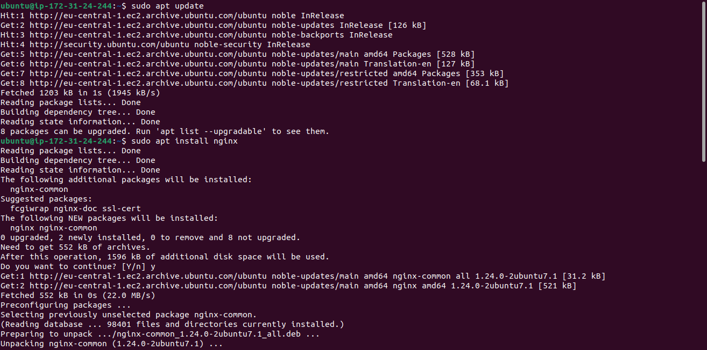
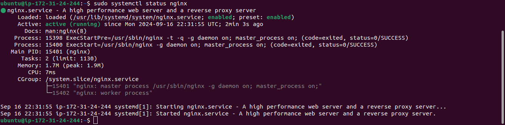
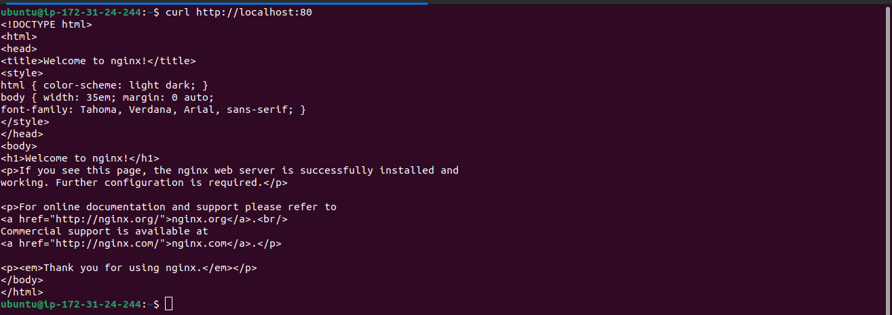
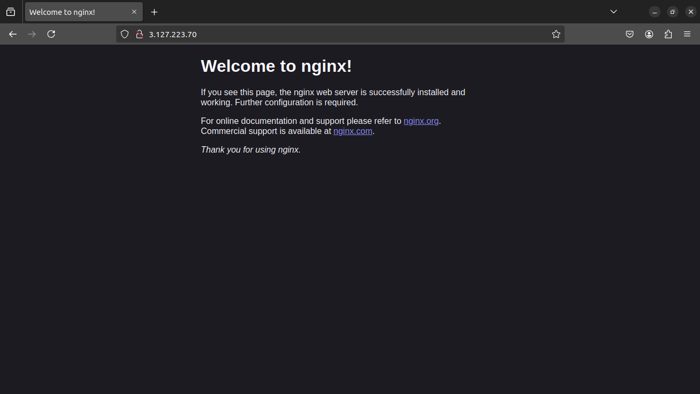

```markdown
# Step 1 - Nginx Web Server Setup on Ubuntu 24.04

This tutorial provides step-by-step instructions to install and configure the **Nginx** web server on an **Ubuntu 24.04** server. The instructions include installing Nginx, verifying the installation, and allowing external access via TCP port 80.

## Prerequisites

- An Ubuntu 24.04 server (preferably an AWS EC2 instance or equivalent)
- SSH access to your server (Port 22 is open by default)

### Update Package Index

Before installing any package on your server, ensure that the package index is up-to-date:

```bash
$ sudo apt update
```

### Install Nginx

Use the `apt` package manager to install Nginx:

```bash
$ sudo apt install nginx
```



When prompted, type `Y` to confirm the installation. After the installation is complete, Nginx will automatically start.

### Verify Nginx is Running

Check if Nginx is active and running:

```bash
$ sudo systemctl status nginx
```



If you see a green status with "active (running)," Nginx has been installed and started successfully.

### Open Port 80 (HTTP) on EC2

To allow web traffic to reach your web server, open **TCP port 80** on your EC2 instance. This can be done via the AWS console:

1. Navigate to your EC2 instance's **Security Groups**.
2. Add an **Inbound Rule** with the following parameters:
   - **Type**: HTTP
   - **Protocol**: TCP
   - **Port Range**: 80
   - **Source**: 0.0.0.0/0 (allows traffic from all IP addresses)
   
This allows external traffic to reach your web server via HTTP (port 80).

### Test Local Access

To ensure the server is accessible locally, run the following commands in your Ubuntu shell:

```bash
$ curl http://localhost:80
```

or

```bash
$ curl http://127.0.0.1:80
```



These commands request Nginx on port 80 locally, verifying that the server is responding to HTTP requests. You should see some raw HTML output from Nginx.

### Test External Access

To test access from the Internet:

1. Retrieve your public IP address. Run the following command to get the public IP of your server:

    ```bash
    curl -s http://169.254.169.254/latest/meta-data/public-ipv4
    ```

2. Open a web browser and enter:

    ```bash
    http://<Public-IP-Address>:80
    ```

   (You can omit the `:80` since web browsers use port 80 by default.)

   

If you see the default Nginx welcome page, your web server is installed correctly and accessible over the Internet.

## Additional Information

- The commands `curl http://localhost:80` and `curl http://127.0.0.1:80` perform similar tasks. The former uses the DNS name `localhost`, and the latter uses the IP address `127.0.0.1`.
- The process of converting a DNS name to an IP address is called **DNS resolution**.

## Conclusion

You have successfully installed the Nginx web server on your Ubuntu 24.04 server and configured it to be accessible from the Internet. Now, you can use this server to host websites or web applications.
