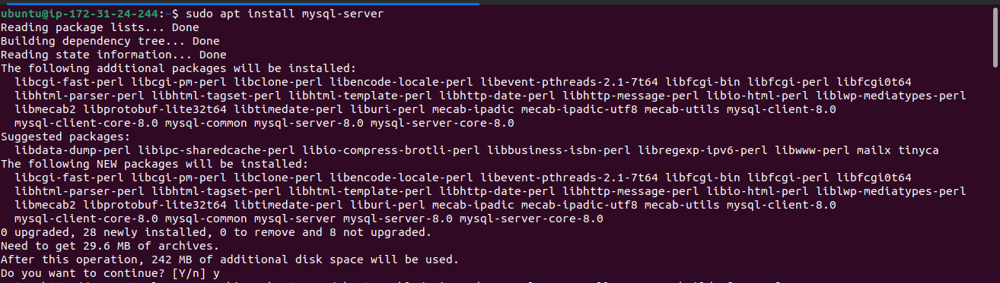
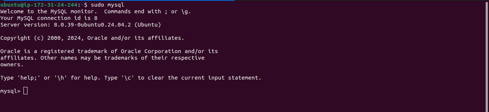
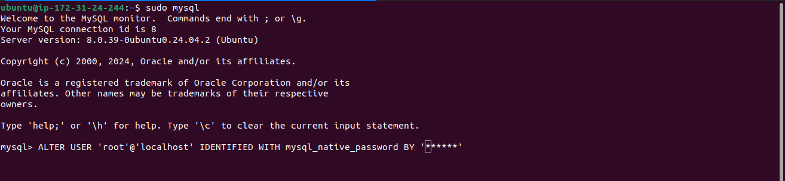
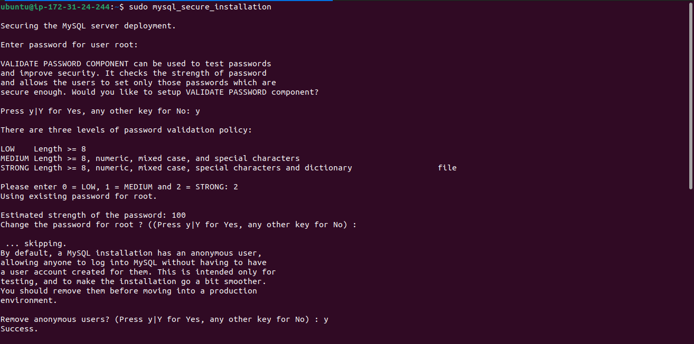
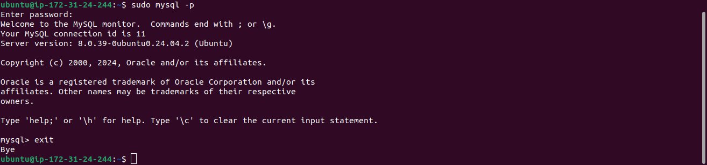

# MySQL Installation and Configuration on Ubuntu 24.04

## Steps

### Step 1 – Install MySQL

To install MySQL on your server, use the `apt` package manager:

```bash
$ sudo apt install mysql-server
```

When prompted, type `Y` and press **ENTER** to confirm the installation. MySQL will be installed and ready to configure.



### Step 2 – Access the MySQL Console

Once the installation is complete, access the MySQL console by typing:

```bash
$ sudo mysql
```

You should see output like the following, confirming your access to the MySQL shell:

```text
Welcome to the MySQL monitor.
Commands end with ; or \g.
Your MySQL connection id is 11
Server version: 8.0.22-0ubuntu0.24.04.2 (Ubuntu)
```

This confirms that MySQL is up and running.



### Step 3 – Set the Root Password

Before securing the MySQL installation, it’s recommended to set a password for the root user. Use the following command to set the password to **PassWord.1**:

```sql
ALTER USER 'root'@'localhost' IDENTIFIED WITH mysql_native_password BY 'PassWord.1';
```

Once the password is set, exit the MySQL shell:

```bash
mysql> exit
```



### Step 4 – Secure the MySQL Installation

Run the `mysql_secure_installation` script to secure the MySQL installation:

```bash
$ sudo mysql_secure_installation
```

You will be prompted with several options:

1. **VALIDATE PASSWORD PLUGIN**: This plugin checks the strength of new passwords. You can choose to enable or skip it:
   - Press `Y` to enable password validation, or any other key to skip.
   
2. If enabled, you will be asked to select a level of password validation policy:
   - **LOW**: Password must be at least 8 characters long.
   - **MEDIUM**: Password must include numbers, mixed case letters, and special characters.
   - **STRONG**: Same as medium, but it also checks against a dictionary of common words.
   
   For example, you can choose **1** (MEDIUM):

   ```bash
   Please enter 0 = LOW, 1 = MEDIUM, and 2 = STRONG: 1
   ```

3. Set and confirm the root password (you can use **PassWord.1** as before). If satisfied with the password, confirm by pressing `Y`.

4. For the remaining prompts (remove anonymous users, disable remote root login, remove test databases, and reload privileges), press `Y` and **ENTER** at each step.



### Step 5 – Test MySQL Login with Password

Now that MySQL is secured, test the login using the password authentication method:

```bash
$ sudo mysql -p
```

You will be prompted for the root password you set earlier (`PassWord.1`). After entering the password, you should see the MySQL prompt:

```text
mysql>
```

To exit the MySQL console:

```bash
mysql> exit
```



### Step 6 – Considerations for PHP Applications

If you plan to use PHP applications with MySQL 8, be aware that the native MySQL PHP library (`mysqlnd`) does not support `caching_sha2_authentication`, the default authentication method for MySQL 8. Therefore, when creating database users for PHP applications, make sure they use the `mysql_native_password` method, as shown in the root password setup above.

## Conclusion

You have successfully installed and secured MySQL on your Ubuntu 24.04 server. MySQL is now ready to be used as part of your web application stack, providing a reliable way to manage and store data.
