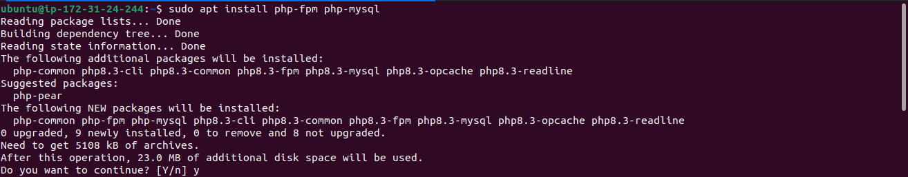

# PHP Installation and Configuration on Ubuntu 24.04

This tutorial covers the installation and configuration of **PHP** on an **Ubuntu 24.04** server. PHP is a server-side scripting language that generates dynamic content for web servers. To work with **Nginx**, PHP requires an external process manager, unlike Apache, which embeds PHP directly into each request.

In this setup, we'll install **php-fpm** (PHP FastCGI Process Manager) and **php-mysql** (a module for connecting PHP with MySQL databases).

## Prerequisites

- An Ubuntu 24.04 server with Nginx and MySQL installed
- SSH access to your server

## Steps

### Install PHP-FPM and PHP-MySQL

To handle PHP requests and allow PHP to interact with MySQL, install the necessary PHP packages:

```bash
$ sudo apt install php-fpm php-mysql
```

When prompted, type `Y` and press **ENTER** to confirm the installation. This will install:

- **php-fpm**: Manages PHP processes using FastCGI to improve performance with Nginx.
- **php-mysql**: Allows PHP to communicate with MySQL databases.

Core PHP packages will also be installed automatically as dependencies.



## Next Steps – Configure Nginx to Use PHP

Now that PHP is installed, you will need to configure Nginx to pass PHP requests to **php-fpm** for processing. This involves updating your Nginx configuration files to handle `.php` requests and route them through PHP's FastCGI processor.

Proceed to the next part of the tutorial to configure Nginx for PHP processing.

## Conclusion

You have successfully installed PHP, along with the required components, on your Ubuntu 24.04 server. With this, you now have a full LEMP stack (Linux, Nginx, MySQL, PHP) ready to serve dynamic content on your web server.
