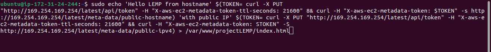

# Configuring Nginx to Use PHP Processor

This section will guide you through configuring **Nginx** to work with **PHP** by creating server blocks and configuring them to process PHP requests. This is essential for hosting dynamic PHP-based websites.

## Prerequisites

- Nginx, PHP, and MySQL installed on Ubuntu 24.04.
- A basic understanding of server blocks (similar to Apache virtual hosts).

## Step 1 — Create a Root Directory for Your Website

First, create a directory to host your website files. We'll use `projectLEMP` as an example domain name:

```bash
$ sudo mkdir /var/www/projectLEMP
```

Change the ownership of the directory to the current user:

```bash
$ sudo chown -R $USER:$USER /var/www/projectLEMP
```


## Step 2 — Create a New Nginx Server Block

Create a new Nginx configuration file for your website inside the `sites-available` directory:

```bash
$ sudo nano /etc/nginx/sites-available/projectLEMP
```

Add the following configuration:

```nginx
server {
    listen 80;
    server_name projectLEMP www.projectLEMP;
    root /var/www/projectLEMP;
    index index.html index.htm index.php;

    location / {
        try_files $uri $uri/ =404;
    }

    location ~ \.php$ {
        include snippets/fastcgi-php.conf;
        fastcgi_pass unix:/var/run/php/php8.3-fpm.sock;
    }

    location ~ /\.ht {
        deny all;
    }
}
```


### Explanation of the Configuration

- **listen 80**: Nginx will listen on port 80 for HTTP requests.
- **server_name**: This defines which domain names Nginx will respond to.
- **root**: Specifies the directory where the website files are located.
- **index**: Defines the priority of index files, giving precedence to `index.html`.
- **location /**: Handles general requests, checking if the requested file exists.
- **location ~ \.php$**: Passes PHP requests to `php-fpm` for processing.
- **location ~ /\.ht**: Prevents access to `.htaccess` files, which are not processed by Nginx.

Save and exit the editor.

## Step 3 — Enable the Configuration

To enable the configuration, create a symbolic link from `sites-available` to `sites-enabled`:

```bash
$ sudo ln -s /etc/nginx/sites-available/projectLEMP /etc/nginx/sites-enabled/
```

Test your Nginx configuration for syntax errors:

```bash
$ sudo nginx -t
```

You should see:

```
nginx: the configuration file /etc/nginx/nginx.conf syntax is ok
nginx: configuration file /etc/nginx/nginx.conf test is successful
```


If no errors are present, disable the default Nginx site by unlinking it:

```bash
$ sudo unlink /etc/nginx/sites-enabled/default
```

Reload Nginx to apply the changes:

```bash
$ sudo systemctl reload nginx
```


## Step 4 — Test Your Configuration

Create a simple `index.html` file in the root directory to test the server block:

```bash
sudo echo 'Hello LEMP from hostname' $(TOKEN=`curl -X PUT \
"http://169.254.169.254/latest/api/token" -H "X-aws-ec2-metadata-token-ttl-seconds: 21600"` && \
curl -H "X-aws-ec2-metadata-token: $TOKEN" -s http://169.254.169.254/latest/meta-data/public-hostname) \
'with public IP' $(TOKEN=`curl -X PUT \
"http://169.254.169.254/latest/api/token" -H "X-aws-ec2-metadata-token-ttl-seconds: 21600"` && \
curl -H "X-aws-ec2-metadata-token: $TOKEN" -s http://169.254.169.254/latest/meta-data/public-ipv4) > \
/var/www/projectLEMP/index.html
```

Open your web browser and navigate to:

```bash
http://<Public-IP-Address>:80
```



You should see the text generated from the `echo` command, displaying your server's public hostname and IP address.

## Step 5 — Test Using Domain Name

You can also access your site using its public DNS name. The output should be the same as when accessed by IP.

```bash
http://<Public-DNS-Name>:80
```

## Conclusion

At this point, your **Nginx** server block is properly configured to serve content from `/var/www/projectLEMP` and handle PHP processing. In the next step, you’ll test PHP processing by creating a sample `.php` file.
