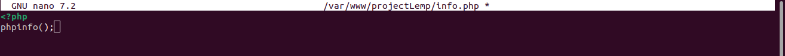
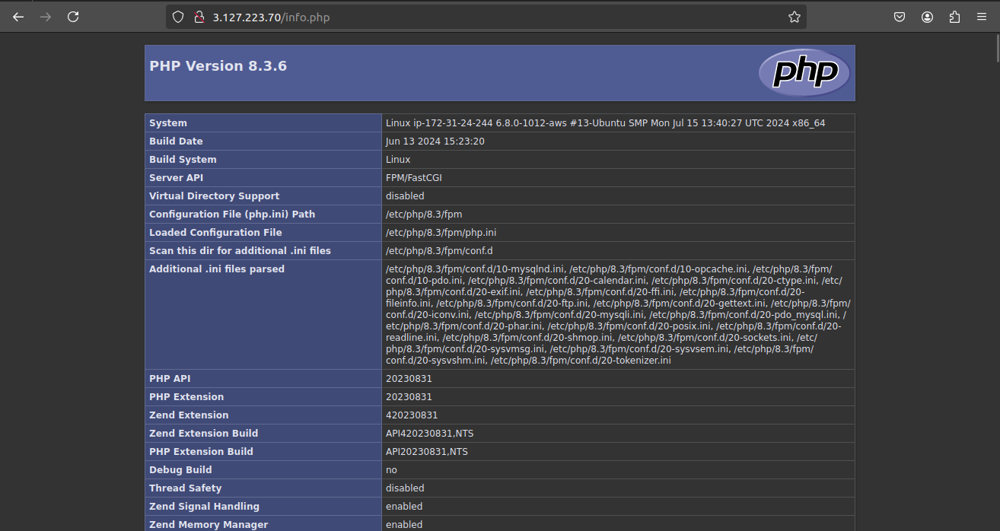
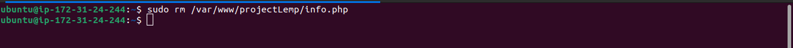

# Testing PHP with Nginx

Now that your LEMP stack is fully configured, it's time to test if **Nginx** is properly handing `.php` files to the **PHP** processor. This will ensure that your server can correctly process dynamic PHP content.

## Step 1 — Create a Test PHP File

To test the PHP processor, create a file called `info.php` in your website's document root:

```bash
$ nano /var/www/projectLEMP/info.php
```

Add the following PHP code to the file:

```php
<?php
phpinfo();
?>
```



This small script will output detailed information about your PHP setup and server configuration when accessed in a browser.

## Step 2 — Access the Test File

To verify that PHP is functioning correctly, open your web browser and visit the domain name or public IP address followed by `/info.php`:

```bash
http://<server_domain_or_IP>/info.php
```



You should see a web page similar to the following, displaying various details about your PHP installation:

- PHP version
- Loaded PHP modules
- Server environment variables
- Configuration settings

## Step 3 — Remove the Test File

Once you have confirmed that PHP is working as expected, it’s important to remove the `info.php` file. This file reveals sensitive information about your server environment, which could be exploited by malicious users.

To remove the file, run the following command:

```bash
$ sudo rm /var/www/projectLEMP/info.php
```



If you ever need to check the PHP configuration in the future, you can always recreate this file.

## Conclusion

At this stage, you’ve successfully tested that **Nginx** is correctly handling PHP files through **php-fpm**. With this, your LEMP stack is fully operational, and you can start building dynamic websites with **PHP** and **MySQL**.
