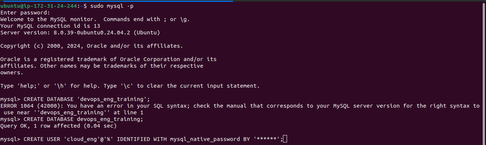
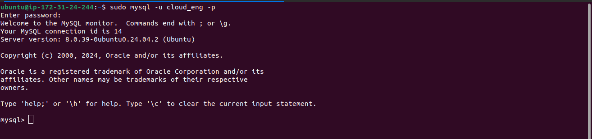
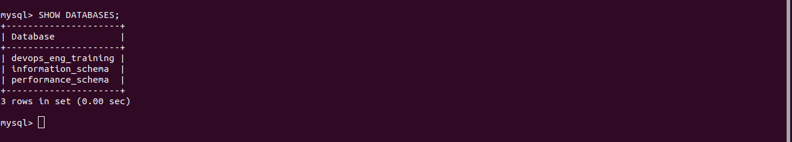
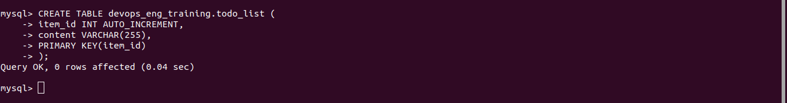
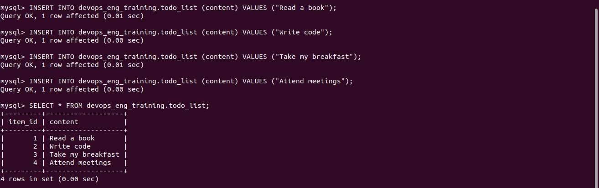
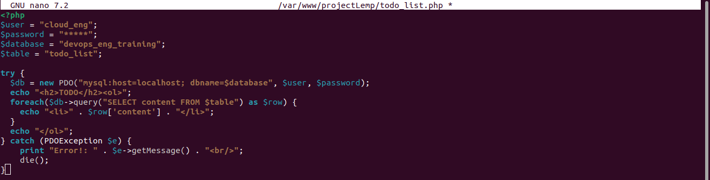
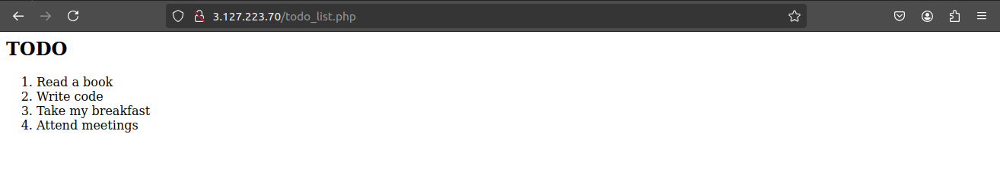

# Retrieving Data from MySQL Database with PHP

In this step, we will create a test database and a table (a simple "To-do list"), then retrieve data from this database using PHP. We will also configure access so that the **Nginx** website can query the database and display the data.

### Step 1 — Create a Database and User

First, log in to the MySQL console as the root user:

```bash
$ sudo mysql
```

Once inside the MySQL console, create a new database:

```sql
mysql> CREATE DATABASE `example_database`;
```

Next, create a new user (`example_user`) with the **mysql_native_password** authentication method and grant it access to the newly created database:

```sql
mysql> CREATE USER 'example_user'@'%' IDENTIFIED WITH mysql_native_password BY 'PassWord.1';
mysql> GRANT ALL ON example_database.* TO 'example_user'@'%';
```

Replace `PassWord.1` with a secure password of your choice. After that, exit the MySQL shell:

```sql
mysql> exit
```



### Step 2 — Create a To-Do List Table

Log in again, this time with the new user account you created:

```bash
$ mysql -u example_user -p
```



When prompted, enter the password for `example_user`. After logging in, confirm that you have access to the `example_database`:

```sql
mysql> SHOW DATABASES;
```



Now, create a table called `todo_list`:

```sql
mysql> CREATE TABLE example_database.todo_list (
    item_id INT AUTO_INCREMENT,
    content VARCHAR(255),
    PRIMARY KEY(item_id)
);
```



### Step 3 — Insert Test Data

Insert a few test items into the `todo_list` table:

```sql
mysql> INSERT INTO example_database.todo_list (content) VALUES ("My first important item");
mysql> INSERT INTO example_database.todo_list (content) VALUES ("My second important item");
mysql> INSERT INTO example_database.todo_list (content) VALUES ("My third important item");
mysql> INSERT INTO example_database.todo_list (content) VALUES ("and this one more thing");
```

To verify that the data was saved correctly, run the following query:

```sql
mysql> SELECT * FROM example_database.todo_list;
```

You should see output similar to this:

```
+---------+--------------------------+
| item_id | content                  |
+---------+--------------------------+
|    1    | My first important item   |
|    2    | My second important item  |
|    3    | My third important item   |
|    4    | and this one more thing   |
+---------+--------------------------+
```

Exit the MySQL console once you have verified the data:

```sql
mysql> exit
```



### Step 4 — Create a PHP Script to Retrieve Data

Next, create a PHP file that connects to the MySQL database and retrieves the data. Use your preferred text editor to create the file:

```bash
$ nano /var/www/projectLEMP/todo_list.php
```


Add the following PHP code to the file:

```php
<?php
$user = "example_user";
$password = "PassWord.1";
$database = "example_database";
$table = "todo_list";

try {
    $db = new PDO("mysql:host=localhost;dbname=$database", $user, $password);
    echo "<h2>TODO</h2><ol>";
    foreach($db->query("SELECT content FROM $table") as $row) {
        echo "<li>" . $row['content'] . "</li>";
    }
    echo "</ol>";
} catch (PDOException $e) {
    print "Error!: " . $e->getMessage() . "<br/>";
    die();
}
?>
```



Replace the username and password in the script with your actual credentials. After saving and closing the file, navigate to the following URL in your web browser:

```bash
http://<Public_domain_or_IP>/todo_list.php
```



You should see a page that displays the content of the `todo_list` table in an ordered list.

### Conclusion

You’ve successfully created a PHP script that connects to the MySQL database, queries the content, and displays it in your web browser. This confirms that your PHP environment is properly set up to interact with your MySQL server.
